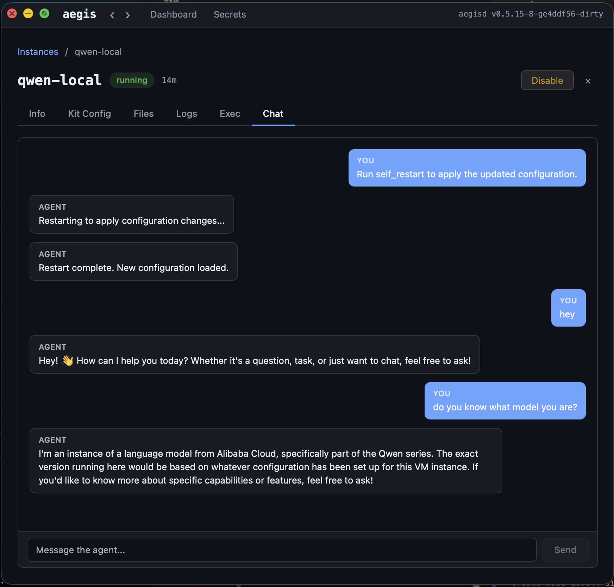

# Aegis Agent Kit

Aegis Agent Kit adds an LLM agent runtime to AegisVM instances. Each agent runs inside an isolated microVM with its own filesystem, network, and tools — and can be reached from the host, from messaging apps, or from other agents.

The agent VM consumes zero CPU when idle. A message — from Claude Code, a messaging bot, or another agent — wakes it in milliseconds.

Agent Kit is an optional add-on — core AegisVM works without it. Install via `brew install aegisvm-agent-kit` or `make install-kit` (from source).

---

# Part 1 — User Manual

## Quick Start

### 1. Desktop app (Chat tab)

Open the Aegis desktop app (`aegis ui`), navigate to your instance, and click the **Chat** tab. Messages stream in real time — including reasoning blocks for local models.



### 2. Claude Code (MCP tether)

```bash
aegis secret set OPENAI_API_KEY sk-...
aegis instance start --kit agent --name my-agent --secret OPENAI_API_KEY
```

Talk to it from Claude Code via MCP:
```
tether_send(instance="my-agent", text="Hello!")
tether_read(instance="my-agent", after_seq=1, wait_ms=15000)
```

### 3. With Telegram

```bash
aegis secret set OPENAI_API_KEY sk-...
aegis secret set TELEGRAM_BOT_TOKEN 123456:ABC-...

aegis instance start --kit agent --name my-agent \
  --secret OPENAI_API_KEY --secret TELEGRAM_BOT_TOKEN

mkdir -p ~/.aegis/kits/my-agent
echo '{"telegram":{"allowed_chats":["*"]}}' \
  > ~/.aegis/kits/my-agent/gateway.json
```

Gateway picks up config within seconds. Send a message to your bot.

### 4. With web search and image generation

```bash
aegis secret set BRAVE_SEARCH_API_KEY BSA...

aegis instance start --kit agent --name my-agent \
  --secret OPENAI_API_KEY --secret BRAVE_SEARCH_API_KEY
```

The agent can now search the web, find images, and generate images — all built-in, no MCP needed.

## Configuration

### agent.json

`/workspace/.aegis/agent.json` — optional, agent works without it.

```json
{
  "model": "openai/gpt-5.2",
  "api_key_env": "OPENAI_API_KEY",
  "max_tokens": 4096,
  "context_chars": 24000,
  "context_turns": 50,
  "system_prompt": "Custom system prompt...",
  "tools": {
    "web_search": { "brave_api_key_env": "BRAVE_SEARCH_API_KEY" },
    "image_search": { "brave_api_key_env": "BRAVE_SEARCH_API_KEY" },
    "image_generate": { "openai_api_key_env": "OPENAI_API_KEY" }
  },
  "mcp": {
    "my-server": {"command": "npx", "args": ["my-mcp@latest"]}
  },
  "memory": {
    "inject_mode": "relevant",
    "max_inject_chars": 2000,
    "max_inject_count": 10,
    "max_total": 500
  }
}
```

The agent can edit this file and call `self_restart` to apply changes at runtime.

### Secrets

Pass secrets when creating the instance:

```bash
aegis instance start --kit agent --name my-agent \
  --secret OPENAI_API_KEY --secret BRAVE_SEARCH_API_KEY
```

Secrets are injected as environment variables inside the VM. MCP servers inherit them automatically.

### Environment variable overrides

| Variable | Description | Default |
|----------|-------------|---------|
| `AEGIS_MODEL` | LLM model override (`openai/gpt-5.2`, `anthropic/claude-sonnet-4-6`) | Auto-detect |
| `AEGIS_MAX_TOKENS` | Max response tokens | 4096 |
| `AEGIS_CONTEXT_CHARS` | Context window character limit | 24000 |
| `AEGIS_CONTEXT_TURNS` | Context window turn limit | 50 |
| `AEGIS_SYSTEM_PROMPT` | System prompt override | Built-in |

Env vars override `agent.json` values.

### Configuring tools

Configure built-in tools via the `tools` section in `agent.json`. Disable tools, replace them with custom MCP servers, or provide tool-specific configuration:

```json
{
  "tools": {
    "web_search": {
      "brave_api_key_env": "BRAVE_SEARCH_API_KEY"
    },
    "image_generate": {
      "enabled": false
    }
  }
}
```

Tools not listed are enabled with defaults. Use `"enabled": false` to disable. Use `*_env` fields to declare which env var holds the tool's API key. Replace a disabled tool with a custom MCP server:

```json
{
  "tools": {
    "image_generate": { "enabled": false }
  },
  "mcp": {
    "my-image-gen": {"command": "/workspace/my-image-mcp"}
  }
}
```

## Profiles

### Lightweight (default)

Base image: `python:3.12-alpine` | Memory: 512MB | Idle: ~40MB

```bash
aegis instance start --kit agent --name my-agent --secret OPENAI_API_KEY
```

Built-in tools + Python for app development. Covers 90% of use cases.

### Heavy (browser automation, Node MCP servers)

Base image: `node:22-alpine` | Memory: 2048MB

```bash
aegis instance start --kit agent --name browser-agent \
  --image node:22-alpine --memory 2048 \
  --secret OPENAI_API_KEY
```

For Chrome DevTools MCP, Playwright MCP, or other Node-based MCP servers that need more memory.

## Local Models

The agent supports local LLM inference servers (Ollama, LM Studio, vLLM) running on the host machine. Traffic is routed securely through the vsock control channel — the VM never gets direct host network access.

### Setup

Use the `host:` prefix in the model string:

```json
{
  "model": "host:ollama/qwen3.5:9b",
  "max_tokens": 4096
}
```

No `api_key_env` needed. Supported providers:

| Provider | Host endpoint | Model string example |
|----------|---------------|----------------------|
| Ollama | `localhost:11434` | `host:ollama/qwen3.5:9b` |
| LM Studio | `localhost:1234` | `host:lmstudio/mistral-7b` |
| vLLM | `localhost:8000` | `host:vllm/meta-llama/Llama-3.1-8B` |

Switching between local and cloud is a one-line change:

```json
{"model": "host:ollama/qwen3.5:9b"}
```
```json
{"model": "openai/gpt-4.1", "api_key_env": "OPENAI_API_KEY"}
```

### Ollama context window (important)

Ollama defaults to a **4096-token** context window regardless of the model's native capability. The agent sends ~29 tools + a system prompt which alone consume ~3500 tokens, leaving almost no room for conversation. The model will silently lose context.

**You must increase Ollama's context window.** Set `num_ctx` to at least 32768:

- **Ollama GUI**: Settings → Context Length → 32768
- **Modelfile**: `FROM qwen3.5:9b` / `PARAMETER num_ctx 32768` / `ollama create my-agent-model`
- **Environment**: `OLLAMA_CONTEXT_LENGTH=32768`

Ollama's OpenAI-compatible endpoint does not accept `num_ctx` as a request parameter — it must be configured at the Ollama level.

Higher context uses more RAM (unified memory on Apple Silicon). 32K is a good balance for tool-using agents.

### Reasoning models

Models that emit chain-of-thought reasoning (Qwen 3.5, QWQ, etc.) are supported. The UI renders reasoning in a collapsible block that opens during generation and collapses when the answer starts. Reasoning tokens are not stored in session context — only the final answer is.

### Tuning for small models

Small models (7B-14B) may struggle with the full tool set — they see the tools correctly but produce confused responses due to attention dilution.

Disable tools you don't need:

```json
{
  "model": "host:ollama/qwen3.5:9b",
  "tools": {
    "image_generate": { "enabled": false },
    "image_search": { "enabled": false },
    "web_search": { "enabled": false },
    "memory_store": { "enabled": false },
    "memory_search": { "enabled": false },
    "memory_delete": { "enabled": false },
    "cron_add": { "enabled": false },
    "cron_list": { "enabled": false },
    "cron_remove": { "enabled": false },
    "self_restart": { "enabled": false },
    "self_info": { "enabled": false },
    "expose_port": { "enabled": false },
    "respond_with_image": { "enabled": false }
  }
}
```

This leaves the core file/shell tools (bash, read_file, write_file, edit_file, list_files, glob, grep, web_fetch) which is sufficient for most development tasks.

---

# Part 2 — Reference

## Built-in Tools

22 tools compiled into the agent binary. Zero overhead, always available, no setup required.

### File operations

| Tool | Description |
|------|-------------|
| `bash` | Execute shell commands (60s timeout, 10KB output cap) |
| `read_file` | Read file contents with optional line ranges (`start_line`/`end_line`) |
| `write_file` | Create/overwrite files, auto-creates parent directories |
| `edit_file` | Targeted edits via text match or line range, returns unified diff |
| `list_files` | List directory contents with sizes |
| `glob` | Find files by pattern (`**/*.go`, `src/**/*.ts`), cap 200 results |
| `grep` | Regex search file contents with include filter, cap 50 matches |

### Web & search

| Tool | Description | Requires |
|------|-------------|----------|
| `web_fetch` | Fetch URL, strip HTML to readable text (10KB cap) | — |
| `web_search` | Search the web, returns titles + URLs + descriptions | `BRAVE_SEARCH_API_KEY` |
| `image_search` | Search for images, returns direct downloadable URLs | `BRAVE_SEARCH_API_KEY` |

### Image handling

| Tool | Description | Requires |
|------|-------------|----------|
| `image_generate` | Generate images from text prompts (DALL-E / gpt-image-1) | `OPENAI_API_KEY` |
| `respond_with_image` | Attach a local image file to the response (user sees it in Telegram, etc.) | — |

### Memory

Persistent memory across sessions. Memories are automatically surfaced in context when relevant.

| Tool | Description |
|------|-------------|
| `memory_store` | Store a fact or note (max 500 chars, rejects secrets) |
| `memory_search` | Search by keyword and/or tag, up to 20 results |
| `memory_delete` | Delete a memory by ID |

Memory config in `agent.json`:
```json
{
  "memory": {
    "inject_mode": "relevant",
    "max_inject_chars": 2000,
    "max_inject_count": 10,
    "max_total": 500
  }
}
```

Injection modes: `relevant` (keyword scoring, default), `recent_only`, `off`.

### Cron (scheduled tasks)

Create recurring tasks that fire on a schedule. The scheduler runs on the host (gateway) — the VM pauses freely between fires and wakes on demand.

| Tool | Description |
|------|-------------|
| `cron_create` | Create a scheduled task (5-field cron expression) |
| `cron_list` | List all cron entries |
| `cron_delete` | Delete a cron entry |
| `cron_enable` / `cron_disable` | Toggle without deleting |

Concurrency: `on_conflict: "skip"` (default — drop fire if previous run active) or `"queue"`.

### Self-management

| Tool | Description |
|------|-------------|
| `self_info` | Get VM instance info (ID, handle, state, endpoints) |
| `self_restart` | Restart agent process (applies config changes, preserves sessions) |

### MCP tools (VM orchestration)

Provided by `aegis-mcp-guest`. Always available, not user-configurable.

| Tool | Description |
|------|-------------|
| `instance_spawn` | Spawn a child VM instance |
| `instance_list` | List child instances |
| `instance_stop` | Stop a child instance |
| `expose_port` | Expose a guest port on the host |
| `unexpose_port` | Remove a port exposure |
| `keepalive_acquire` | Prevent VM pause during long work |
| `keepalive_release` | Release keepalive lease |

## Tether

Tether is the universal transport for all agent communication — host delegation, messaging apps, cron, and multi-agent orchestration all flow through tether frames. It provides wake-on-message, session isolation, ordered delivery, and async read/write.

See [Tether](TETHER.md) for the full protocol reference, frame types, API endpoints, and sequence number semantics.

## Sessions

Independent conversation histories per `channel:session_id`:

```
/workspace/sessions/host_default.jsonl      # Claude delegation
/workspace/sessions/telegram_123456.jsonl   # Telegram user
/workspace/sessions/cron_health-check.jsonl # Cron job
```

Sessions persist across VM restarts (workspace survives disable→start).

## Workspace

- Auto-created at `~/.aegis/data/workspaces/{handle}/` if no `--workspace` provided
- Explicit `--workspace /path/to/project` uses the user's directory
- Persists across stop/start cycles
- Contains sessions, memory, cron config, blobs, and agent config

## Use Cases

### Agent delegation
Claude delegates tasks to isolated agents with their own context and tools.

### Multi-agent orchestration
Agents spawn sub-agents via VM orchestration tools. Each sub-agent runs in its own VM.

### Messaging bot
Connect to Telegram with wake-on-message, streaming responses, and scale-to-zero.

### Scheduled tasks
Create cron jobs for health checks, reports, polling — VM wakes only when needed.

### App development
Agent builds and serves Python/Node apps inside the VM with port exposure to the host.
