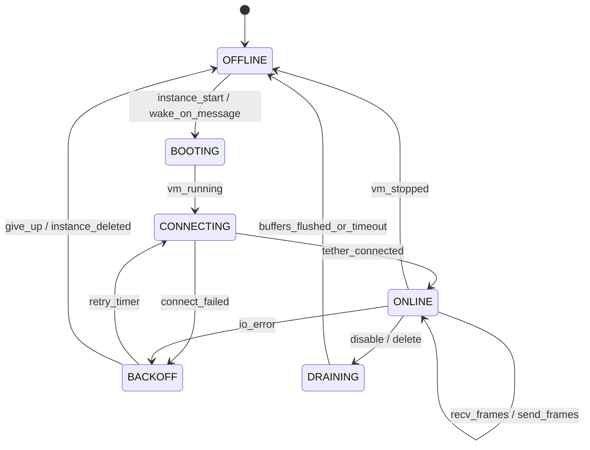
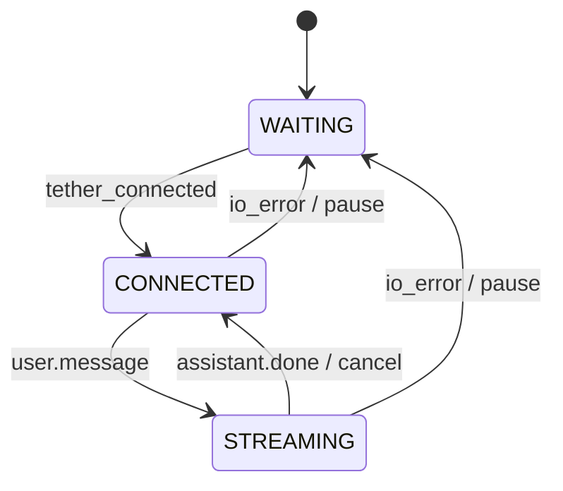

# Aegis Agent Kit v0.1
## Streaming Tether + Session-Aware Agent Runtime

**Status:** Implemented (v0.1)
**Focus:** Defines the **Aegis Agent Kit** — a three-part system enabling messaging-driven autonomous agents running inside Aegis instances.

### Implementation Status

| Component | Status | Notes |
|-----------|--------|-------|
| **Tether protocol** | Done | `tether.frame` notifications over control channel, `internal/tether/` package |
| **TetherStore** | Done | Per-instance ring buffer with pub/sub, modeled after LogStore |
| **Tether API** | Done | `POST /v1/instances/{id}/tether` (ingress + wake), `GET .../tether/stream` (egress NDJSON) |
| **Harness passthrough** | Done | Forwards `tether.frame` to agent at 7778, buffer for cold boot race |
| **Guest tether send** | Done | `POST /v1/tether/send` on guest API (7777), agent → host egress |
| **Agent runtime** | Done | `cmd/aegis-agent`, OpenAI + Claude streaming, JSONL sessions, context windowing |
| **Gateway (Telegram)** | Done | `cmd/aegis-gateway`, long-polling, wake-on-message, streaming edits, typing |
| **Gateway auto-start** | Done | `aegis up` starts gateway if `~/.aegis/gateway.json` exists, `--no-gateway` to suppress |
| **Secret resolution** | Done | Gateway resolves bot token from instance env (injected via `--secret TELEGRAM_BOT_TOKEN`) |
| **OCI injection** | Done | `aegis-agent` + `aegis-mcp-guest` auto-injected into overlays via `InjectGuestBinaries` |
| **Version injection** | Done | Build-time `ldflags` from git tag, shared `internal/version/` package |
| **MCP integration** | Not started | Agent does not invoke MCP tools yet (planned v0.2) |
| **At-least-once delivery** | Not started | `msg_id` dedup + `event.ack` not implemented (fire-and-forget for now) |
| **control.cancel** | Not started | Cancel frame type defined but not wired to LLM cancellation |
| **User identity in payload** | Done | `user.message` includes `user.id`, `user.username`, `user.name` for group chat attribution |
| **Multi-channel** | Not started | Only Telegram adapter implemented |

**Non-goals (v0.1):**
- Full IDE-grade agent experience (Claude Code-level indexing, etc.)
- Interactive PTY shell
- Generic UI canvas (apps are spawned as separate Aegis instances)

---

# 1. Aegis Agent Kit Overview

The defining property of Aegis Agent Kit is that **messaging ingress lives outside the VM**, enabling wake-on-message and true scale-to-zero agents. The agent VM consumes zero CPU when idle. A new message wakes it in milliseconds.

Aegis Agent Kit consists of **three distinct parts**:

1. **Aegis Gateway (Host-side)**
   Aegis Gateway is the host-side component of Agent Kit responsible for external messaging ingress, wake-on-message lifecycle control, and streaming UX rendering.
   - Telegram channel (initial)
   - Future: Discord, WhatsApp, Famiglia, etc.
   - Keeps long-lived connections/polling
   - Converts channel events ↔ Tether frames
   - Handles typing indicators & rendering policies

2. **Aegis Tether (Host ↔ Guest boundary)**  
   - Bidirectional, lifecycle-aware message stream
   - Carries chat messages, streaming output, presence signals, control frames
   - Survives pause/resume (rebinds on wake)
   - Not a PTY
   - Not MCP
   - Pure messaging + control plane for Agent Kit

3. **Guest Agent Runtime (Inside VM)**  
   - Session-aware LLM runtime
   - Uses LLM APIs (Claude/OpenAI/etc.)
   - Manages context + summaries
   - Streams output
   - Calls MCP tools (including Aegis Guest MCP)
   - Can spawn app instances (`--expose`) instead of “canvas”

---

# 2. How Agent Kit fits Aegis Core

Aegis Core provides:

- VM lifecycle (start, pause, resume, stop)
- Networking (router, wake-on-connect)
- Registry + instance management
- Logs + execution
- Guest MCP interface

Agent Kit sits *on top*:

```
                Host (always-on)                                   Guest (pauseable)
┌────────────────────────────────────┐               ┌─────────────────────────────────────────┐
│ Aegis Gateway (Agent Kit)                │               │ Harness (Aegis Core)                   │
│  - getUpdates/webhook              │               │  - ControlChannel (RPC)                 │
│  - typing indicator                │   Aegis       │  - Aegis Tether Endpoint                │
│  - message edits/throttling        │   Tether      │  - starts Agent Runtime                 │
└───────────────┬────────────────────┘   stream      └──────────────┬──────────────────────────┘
                │                                                   │
                ▼                                                   ▼
        ┌────────────────┐                               ┌─────────────────────────┐
        │ aegisd (Core)   │                               │ Agent Runtime (Kit)     │
        │ - wake/resume   │                               │  - sessions + context    │
        │ - instance mgmt │                               │  - LLM streaming         │
        └────────────────┘                               │  - MCP tools             │
                                                         └─────────────────────────┘
```

**Key boundary:**  
Aegis Core handles isolation + lifecycle.  
Agent Kit handles messaging + intelligence.

---

# 3. Aegis Tether

Aegis Tether is the bidirectional, framed stream between host and guest.

It is:
- Lifecycle-aware
- Streaming-first
- Session-aware
- Not PTY
- Not MCP
- Not orchestration

It exists purely to deliver:
- User messages
- Streaming assistant output
- Presence (typing/thinking)
- Control signals (cancel)

---


## 3.1 Tether State Machine (formal)

Tether is a **reliable(ish)** streaming channel across a boundary that can *pause* at any time.
So we model it explicitly as two coupled state machines:

- **Host Tether Endpoint** (authoritative): owns buffering, retries, wake decisions, adapter QoS.
- **Guest Tether Endpoint**: owns session routing, dedupe, acks, and streaming output.

### 3.1.1 Host Endpoint States



**Semantics**
- **OFFLINE**: no active stream; host may still accept IM messages and enqueue them.
- **BOOTING**: aegisd is creating/resuming the VM (may take time).
- **CONNECTING**: attempting to establish the framed stream to the guest.
- **ONLINE**: stream is up; frames flow both directions.
- **BACKOFF**: transient failure; exponential backoff with jitter.
- **DRAINING**: shutdown path; stop typing, flush final edits, then close.

### 3.1.2 Guest Endpoint States



**Semantics**
- Guest treats disconnects as normal (pause/resume).
- Guest MUST be able to resume mid-conversation using persisted session state.

### 3.1.3 Message Delivery Guarantees

Tether is **at-least-once** for inbound user messages.

Mechanism:
- Host assigns `msg_id` and monotonic `seq`.
- Guest responds with `event.ack {msg_id, seq}` after durable enqueue (session store).
- Host may resend unacked messages on reconnect.
- Guest dedupes by `msg_id`.

**Bounded buffering (host)**
- Per-session queue limit (e.g. 1–5 MB or N messages).
- If full: apply adapter-specific policy (drop oldest, reject, or “busy” response).

### 3.1.4 Presence and Streaming Rules

- Host sends **typing** based on receiving `status.presence {state:"thinking|typing"}` *or* based on active `assistant.delta` stream.
- Guest emits `assistant.delta` frequently (50–200ms batches).
- Host throttles outward surface (Telegram edits, etc.) independently of delta rate.

### 3.1.5 Control Signals

- `control.cancel` is best-effort; guest should honor promptly.
- `control.ping` / `status.pong` keep the connection observable; no “keepalive lease” implied.


# 4. Requirements (MVP)

## 4.1 Streaming-first UX (hard requirement)

Tether MUST support incremental assistant output and signals for:

- Typing indicator
- Partial rendering
- Cancellation
- Backpressure

## 4.2 Session + Identity (hard requirement)

Each frame must include:

- `channel`
- `session_id`
- `user_id`
- `msg_id`
- monotonic `seq`

## 4.3 Pause/Resume Safety

- VM may pause anytime.
- Host buffers inbound events (bounded).
- Guest dedupes by `msg_id` on resume.

---

# 5. Tether Protocol (NDJSON stream)

## 5.1 Transport (Control Channel Overlay)

Tether **does not introduce a new socket**. It rides on Aegis’ existing guest↔host **control channel** (JSON-RPC 2.0 over vsock / unix socket, depending on backend).

**Why:** the harness already has a long-lived, authenticated channel to `aegisd`, and the host already runs a demuxer loop. Tether becomes an application-layer namespace on top of that channel.

### Message namespace

All Tether frames are JSON-RPC notifications under a reserved prefix:

- `tether.open`
- `tether.message`
- `tether.delta`
- `tether.done`
- `tether.typing`
- `tether.ack`
- `tether.close`

The control plane continues to use its own methods (`run`, `exec`, `shutdown`, `log`, `processExited`, …). The demuxer routes by `method` prefix.

### Ordering + backpressure

- Ordering is **per instance**, defined by the underlying control channel stream.
- Backpressure is handled by:
  - bounded in-memory queues (host + guest)
  - `tether.ack` (at-least-once delivery with dedupe)
  - optional coalescing of `tether.delta` (e.g. 50–200ms batching)

### What Tether is *not*

- Not a general pub/sub bus
- Not a tool protocol (MCP remains the tool protocol)
- Not a replacement for the Aegis API

## 5.2 Envelope

```json
{
  "v": 1,
  "type": "user.message",
  "ts": "2026-02-22T00:00:00.000Z",
  "session": { "channel": "telegram", "id": "123456789" },
  "msg_id": "01HZY...ULID",
  "seq": 42,
  "payload": {}
}
```

## 5.3 `user.message` Payload

```json
{
  "text": "Hello!",
  "user": {
    "id": "123456",
    "username": "johndoe",
    "name": "John"
  }
}
```

The `user` object is included by the gateway for user attribution in group chats. Fields:
- `id` — channel-specific user identifier (stable across messages)
- `username` — channel handle (e.g. Telegram username), may be absent
- `name` — display name

The agent runtime prepends `[name]: ` to the message content when user info is present, giving the LLM awareness of who is speaking in multi-user sessions.

## 5.4 Core Frame Types

### Host → Guest

- `user.message`
- `control.cancel`
- `control.ping`

### Guest → Host

- `assistant.delta`
- `assistant.done`
- `status.presence`
- `event.ack`
- `error`

---

# 6. Aegis Gateway — Telegram Channel (MVP)

## 6.0 Wake-on-Message (Core Behavior)

Wake-on-message is the primary architectural advantage of Agent Kit. Aegis Gateways MUST run on the host to preserve this property.

```
Telegram update received
        ↓
Aegis Gateway (host)
        ↓
Resolve agent instance
        ↓
If instance state == PAUSED or STOPPED:
    call EnsureInstance(instance_id)
        ↓
Wait for RUNNING
        ↓
Send tether.message frame
```

Key properties:
- **Wake decision lives entirely on host side** — guest never polls Telegram
- **Paused VM consumes zero CPU** — no background polling, no heartbeat noise
- **First message after idle triggers resume** — sub-second for paused, ~1s for stopped
- **Wake happens before message delivery** — tether.message is only sent after VM is RUNNING
- **Transport reconnect is transparent to adapter** — adapter doesn't know or care about VM lifecycle

Edge cases:
- **Instance already RUNNING**: no wake needed, send tether.message immediately
- **Instance DISABLED**: reject message, reply "agent offline" via Telegram
- **Multiple concurrent sessions**: single VM handles all sessions; one wake serves all pending messages
- **Wake race (two messages arrive while stopped)**: EnsureInstance is idempotent; second call blocks until first boot completes, then both messages are delivered

## 6.1 Typing

- Call `sendChatAction(chat_id, "typing")` every ~4s while streaming
- Stop immediately on `assistant.done`

## 6.2 Streaming via Edits

- Create message on first delta
- `editMessageText` max 1x/sec
- Flush early on sentence boundary
- Chunk when message exceeds safe Telegram limits

## 6.3 Cancel

- Stop typing
- Optionally mark as cancelled

---

# 7. Guest Agent Runtime

## 7.1 Responsibilities

v0.1 is intentionally **thin**: it is a bridge between IM messages and an LLM API, with streaming back to the user.

Must-have (v0.1):
- Multi-session aware (one VM can handle multiple chats)
- Workspace-backed session log (append-only JSONL/SQLite)
- Basic context windowing (last N turns + optional short summary stub)
- Streaming responses (`tether.delta` + typing indicators)
- Cancellation (best-effort)
- Ability to invoke MCP tools (including `aegis-mcp-guest`)

Deferred (v0.2+):
- Sophisticated planning / tool orchestration frameworks
- Automatic long-horizon summarization + “pinned memory”
- Retrieval/indexing
- Multi-agent role separation (planner/worker/etc.)

## 7.2 Session Model

Session key: `"{channel}:{session_id}"`

Persist in workspace (choose one, v0.1):
- **JSONL** per session (`sessions/<key>.jsonl`) — simplest
- **SQLite** (`sessions.db`) — better indexing later

v0.1 persisted fields:
- message log (user/assistant/tool)
- last activity timestamp
- optional `summary` string (may be empty in v0.1)

No “pinned facts” or complex memory schema in v0.1 (keep it boring).

## 7.3 Context Management (v0.1)

Context assembly is deliberately simple:

1. System policy / guardrails
2. Optional session summary (may be empty)
3. Last **N** conversation turns (truncate by token/char budget)
4. Recent tool outputs (bounded)

When over budget:
- Drop oldest turns first
- Optionally refresh a short summary (“compress old turns to 1–2k chars”) — future-friendly, but not required for v0.1

## 7.4 Streaming

- Emit `assistant.delta`
- Batch ~50–200ms if needed
- Emit `assistant.done`


## 7.5 MCP Integration (Guest)

The guest runtime should be able to call tools via MCP, including **Aegis Guest MCP** (`aegis-mcp-guest`) for spawning work instances.

Recommended wiring (v0.1):
- Ship `aegis-mcp-guest` in the rootfs or mount it read-only
- The runtime launches MCP servers as subprocesses and speaks MCP over stdio
- Tool config lives in workspace (so users can add/remove MCP servers without rebuilding the image)

This keeps “message transport” (Tether) and “tool invocation” (MCP) orthogonal:
- Tether: chat I/O + streaming UX
- MCP: structured tools + orchestration API


---

# 8. Pause/Resume

Because Tether rides on the control channel:

- **Pause** will freeze the stream (no frames flow).
- The host side should treat missing heartbeats / stalled reads as “instance is paused or wedged”, and rely on the existing Aegis power-state transitions.
- **Resume** continues the same channel if the backend preserves it; otherwise the host re-establishes the control channel and Tether session.

Reliability rules:
- Host may re-send the last unacked `tether.message` after reconnect.
- Guest dedupes by `msg_id`.
- Streaming (`tether.delta`) is best-effort; if interrupted, the runtime can re-send a final “done” with the assembled text or just continue streaming.


# 9. Acceptance Tests

1. Streaming + typing visible
2. Cancel stops within 1–3s
3. Pause/resume preserves session
4. Large outbound payload works
5. Concurrent sessions route correctly
